# TapHoaNho - Retail Store Management System

> Hệ thống Quản lý Cửa hàng Bán lẻ - Full-stack Web Application

## Mục lục

- [Tổng quan](#tổng-quan)
- [Tech Stack](#tech-stack)
- [Kiến trúc hệ thống](#kiến-trúc-hệ-thống)
  - [Backend Architecture](#backend-architecture)
  - [Frontend Architecture](#frontend-architecture)
- [Call Graph - API Endpoints](#call-graph---api-endpoints)
  - [Authentication Flow](#authentication-flow)
  - [Order Endpoints](#order-endpoints)
  - [Inventory Endpoints](#inventory-endpoints)
- [Design Patterns](#design-patterns)
  - [Backend Patterns](#backend-patterns)
  - [Frontend Patterns](#frontend-patterns)
- [Database Schema](#database-schema)
- [Chức năng](#chức-năng)

---

## Tổng quan

**TapHoaNho** là hệ thống quản lý cửa hàng bán lẻ toàn diện, được xây dựng với kiến trúc modern full-stack. Hệ thống hỗ trợ các nghiệp vụ thường ngày bao gồm: quản lý khách hàng, sản phẩm, nhà cung cấp, khuyến mãi, đơn hàng, thanh toán và tài khoản nhân viên.

---

## Tech Stack

### Backend
| Công nghệ | Mục đích |
|-----------|----------|
| **ASP.NET Core 9** | Web API Framework |
| **Entity Framework Core** | ORM - Database Access |
| **PostgreSQL** | Relational Database |
| **JWT + HttpOnly Cookies** | Authentication & Authorization |
| **AutoMapper** | Object Mapping |
| **FluentValidation** | Request Validation |

### Frontend
| Công nghệ | Mục đích |
|-----------|----------|
| **React 19** | UI Library |
| **TypeScript** | Type Safety |
| **Vite** | Build Tool |
| **TanStack Router** | Type-safe Routing |
| **TanStack Query** | Server State Management |
| **Zustand** | Client State Management |
| **Ant Design** | UI Component Library |
| **Axios** | HTTP Client |

---

## Kiến trúc hệ thống

### Backend Architecture

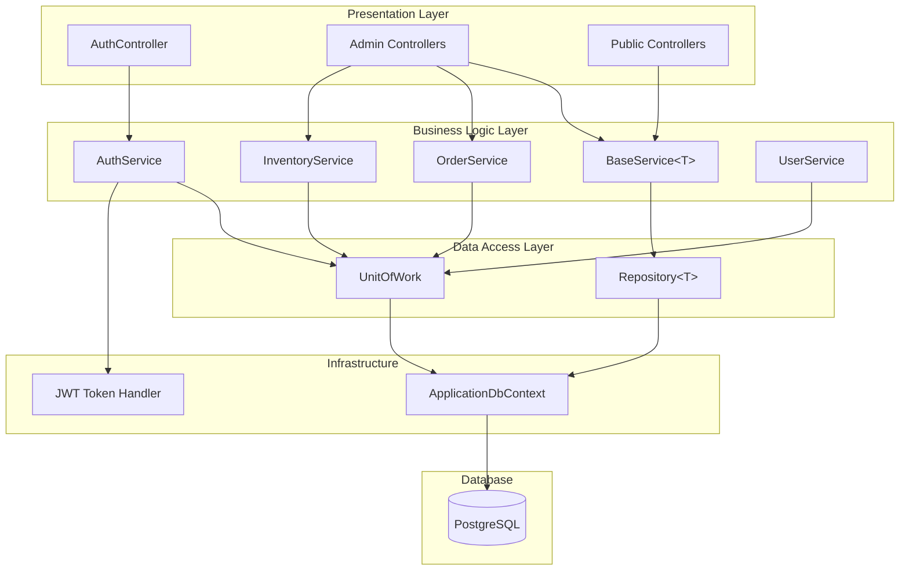

#### Backend Layer Description

| Layer | Mô tả | Components |
|-------|-------|------------|
| **Presentation** | Xử lý HTTP requests/responses | Controllers (Auth, Admin/*, Public/*) |
| **Business Logic** | Business rules & validation | Services (BaseService, OrderService, etc.) |
| **Data Access** | Database operations | Repository Pattern, Unit of Work |
| **Infrastructure** | Cross-cutting concerns | DbContext, JWT, AutoMapper |

---

### Frontend Architecture

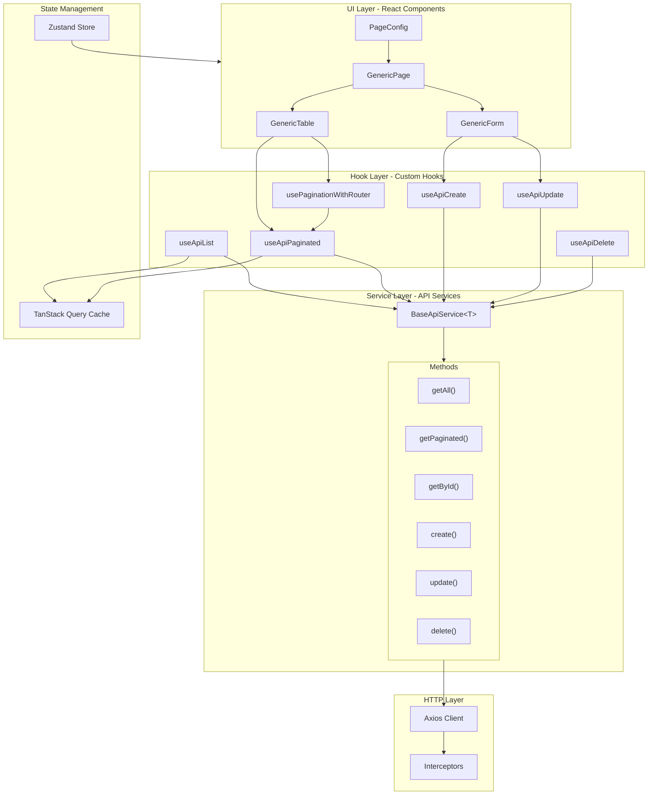

#### Frontend 3-Tier Architecture

```
┌─────────────────────────────────────────────────────────────────┐
│                         UI LAYER                                 │
│  ┌───────────────────────────────────────────────────────────┐ │
│  │              GenericPage (Container)                       │ │
│  │   ┌─────────────┐  ┌─────────────┐  ┌─────────────────┐  │ │
│  │   │GenericTable │  │ GenericForm │  │ GenericActions  │  │ │
│  │   │  - columns  │  │  - fields   │  │  - CRUD buttons │  │ │
│  │   │  - toolbar  │  │  - validate │  │  - custom acts  │  │ │
│  │   └─────────────┘  └─────────────┘  └─────────────────┘  │ │
│  └───────────────────────────────────────────────────────────┘ │
│                              │                                   │
│                    PageConfig (entity-specific)                  │
└──────────────────────────────┼───────────────────────────────────┘
                               │
┌──────────────────────────────▼───────────────────────────────────┐
│                        HOOK LAYER                                 │
│  ┌───────────────────────────────────────────────────────────┐  │
│  │              Universal Hooks (Factory Pattern)             │  │
│  │   ┌────────────┐  ┌──────────────┐  ┌─────────────────┐  │  │
│  │   │ useApiList │  │useApiPaginated│  │useApiCreate     │  │  │
│  │   │ useApiDetail│ │useApiUpdate   │  │useApiDelete     │  │  │
│  │   └────────────┘  └──────────────┘  └─────────────────┘  │  │
│  │                                                            │  │
│  │   ┌────────────────────────────────────────────────────┐ │  │
│  │   │         usePaginationWithRouter                     │ │  │
│  │   │  - URL sync  - Pagination  - Search  - Sort        │ │  │
│  │   └────────────────────────────────────────────────────┘ │  │
│  └───────────────────────────────────────────────────────────┘  │
└──────────────────────────────┼───────────────────────────────────┘
                               │
┌──────────────────────────────▼───────────────────────────────────┐
│                      SERVICE LAYER                                │
│  ┌───────────────────────────────────────────────────────────┐  │
│  │           BaseApiService<TData, TCreate, TUpdate>          │  │
│  │   ┌──────────────────────────────────────────────────┐   │  │
│  │   │  getAll(params?)     │  getPaginated(params?)     │   │  │
│  │   │  getById(id)         │  create(data)              │   │  │
│  │   │  update(id, data)    │  patch(id, data)           │   │  │
│  │   │  delete(id)          │  custom(method, path, ...) │   │  │
│  │   └──────────────────────────────────────────────────┘   │  │
│  └───────────────────────────────────────────────────────────┘  │
└──────────────────────────────────────────────────────────────────┘
```

---

## Call Graph - API Endpoints

### Authentication Flow

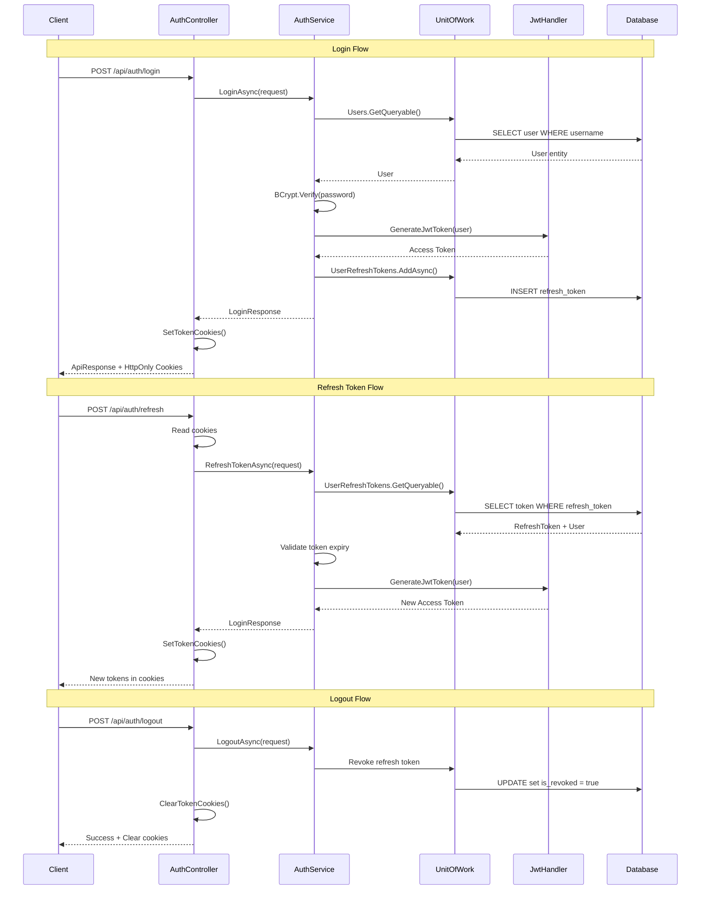

---

### Order Endpoints

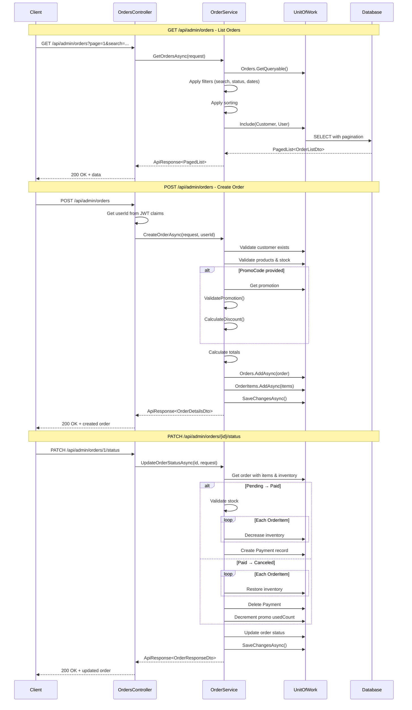

---

### Inventory Endpoints

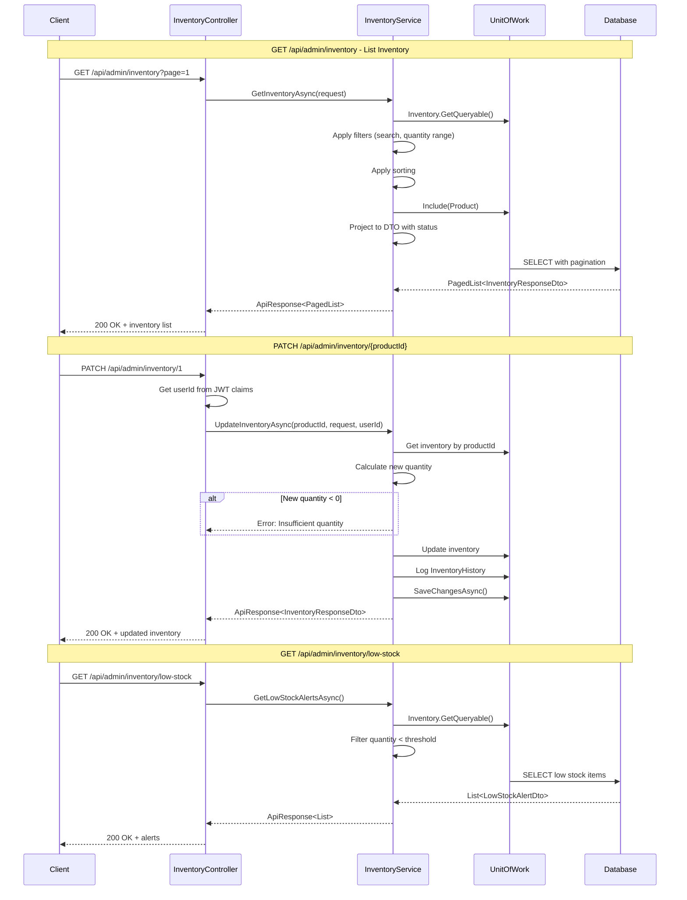

---

## Design Patterns

### Backend Patterns

#### 1. Repository Pattern

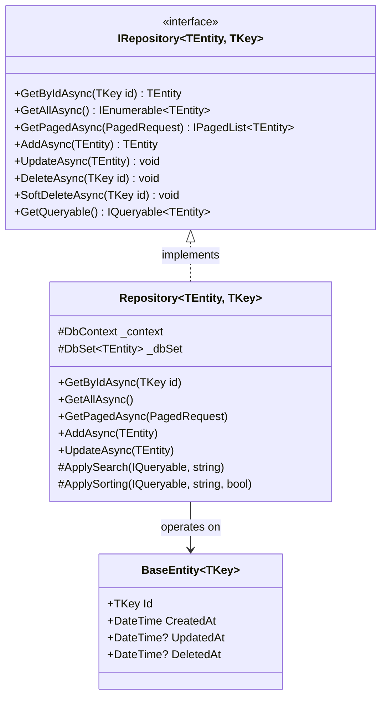

**Mô tả:**
- **Generic Repository** cung cấp các CRUD operations chuẩn
- Hỗ trợ pagination, search, sorting tự động
- Soft delete với `DeletedAt` timestamp
- Override `ApplySearch()` cho entity-specific search logic

---

#### 2. Service Layer Pattern

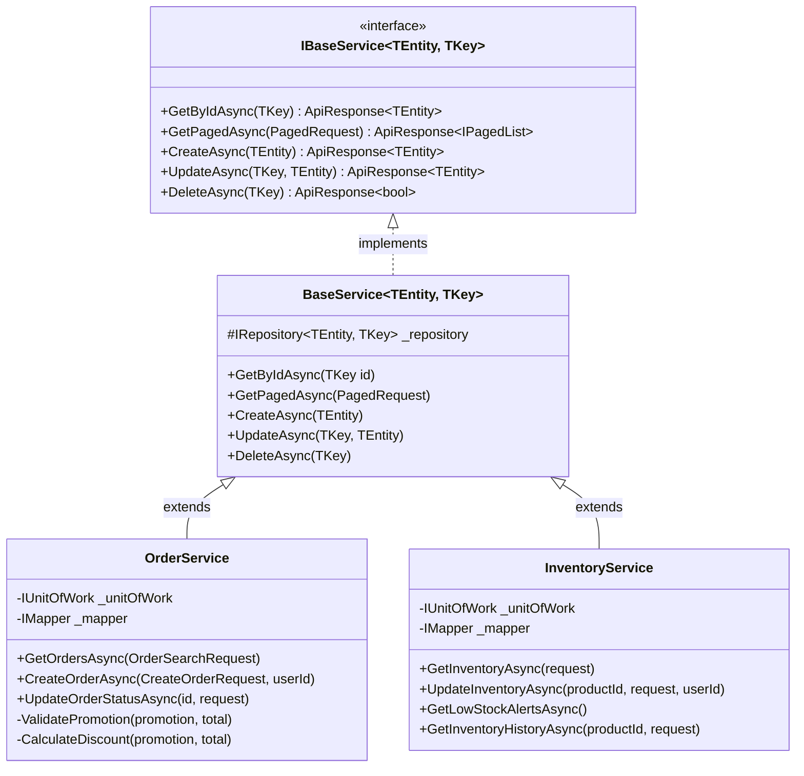

**Mô tả:**
- **BaseService** xử lý CRUD operations cơ bản
- **Domain Services** (OrderService, InventoryService) xử lý business logic phức tạp
- Tất cả response được wrap trong `ApiResponse<T>` để chuẩn hóa

---

#### 3. Unit of Work Pattern

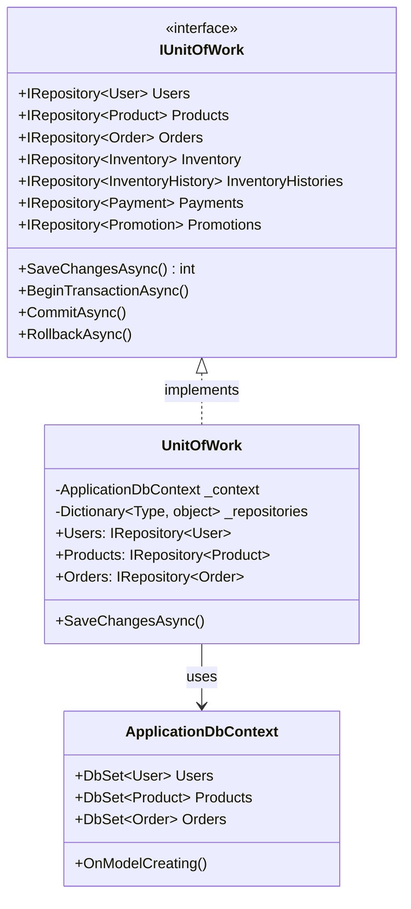

**Mô tả:**
- Quản lý transaction across multiple repositories
- Đảm bảo data consistency
- Lazy initialization của repositories

---

### Frontend Patterns

#### 1. GenericPage Pattern (Configuration-Driven)

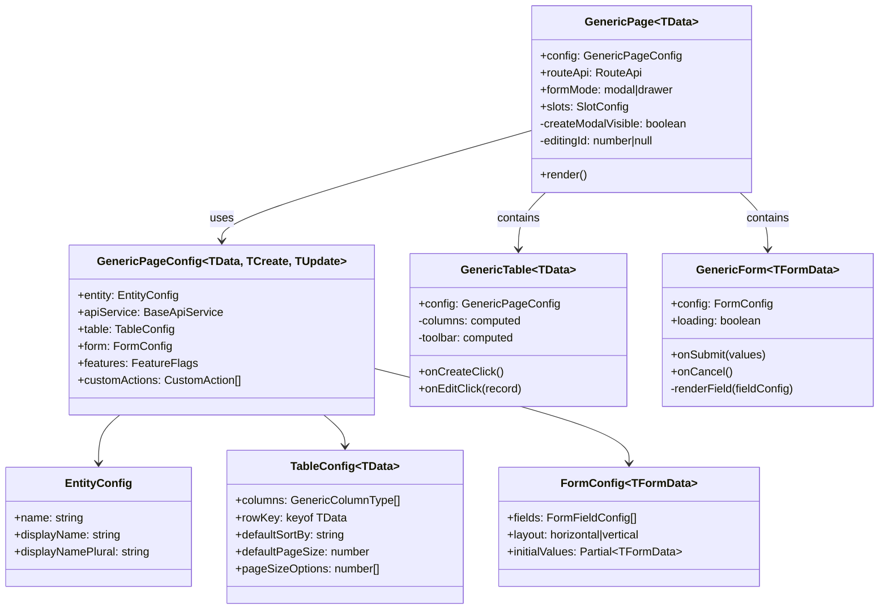

**Mô tả:**
- **Configuration-Driven**: Mỗi entity chỉ cần định nghĩa config
- **DRY Principle**: GenericPage render dựa trên config
- **Slot Pattern**: Cho phép customize header, statistics, filters
- **Type-safe**: Full TypeScript generics support

---

#### 2. Universal Hook Pattern (Factory)

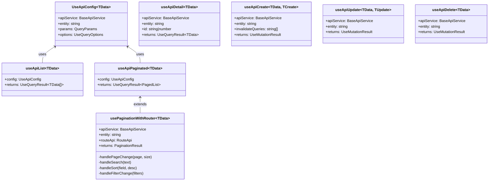

**Mô tả:**
- **Factory Pattern**: Tạo hooks từ config
- **Automatic Cache Management**: TanStack Query handles caching
- **URL Sync**: `usePaginationWithRouter` sync state với URL
- **Invalidation**: Tự động invalidate related queries

---

#### 3. BaseApiService Pattern

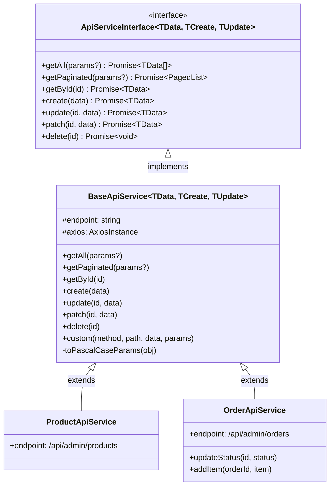

**Mô tả:**
- **Generic Service**: BaseApiService xử lý CRUD operations
- **Param Conversion**: Tự động convert camelCase → PascalCase
- **Response Unwrap**: Tự động unwrap ApiResponse wrapper
- **Custom Methods**: `custom()` cho endpoints đặc biệt

---

## Database Schema

```mermaid
erDiagram
    users ||--o{ orders : creates
    users ||--o{ user_refresh_tokens : has
    users ||--o{ inventory_history : logs

    customers ||--o{ orders : places

    categories ||--o{ products : contains
    suppliers ||--o{ products : provides

    products ||--|| inventory : has
    products ||--o{ order_items : appears_in
    products ||--o{ inventory_history : tracked_by

    orders ||--o{ order_items : contains
    orders ||--o{ payments : has
    orders }o--|| promotions : applies

    users {
        int id PK
        string username UK
        string password
        string full_name
        int role
        datetime created_at
        datetime updated_at
        datetime deleted_at
    }

    customers {
        int id PK
        string name
        string phone
        string email
        string address
        datetime created_at
    }

    products {
        int id PK
        string product_name
        string barcode UK
        decimal price
        string unit
        int category_id FK
        int supplier_id FK
        datetime created_at
    }

    inventory {
        int id PK
        int product_id FK UK
        int quantity
        datetime updated_at
    }

    orders {
        int id PK
        int customer_id FK
        int user_id FK
        int promo_id FK
        datetime order_date
        string status
        decimal total_amount
        decimal discount_amount
    }

    order_items {
        int id PK
        int order_id FK
        int product_id FK
        int quantity
        decimal price
        decimal subtotal
    }

    payments {
        int id PK
        int order_id FK
        decimal amount
        string payment_method
        datetime payment_date
    }

    promotions {
        int id PK
        string promo_code UK
        string description
        string discount_type
        decimal discount_value
        decimal min_order_amount
        date start_date
        date end_date
        int usage_limit
        int used_count
        string status
    }
```

---

## Chức năng

### Core Features

| Module | Chức năng | Admin | Staff |
|--------|-----------|:-----:|:-----:|
| **Authentication** | Login, Logout, Token Refresh | ✅ | ✅ |
| **Users** | CRUD người dùng | ✅ | ❌ |
| **Customers** | CRUD khách hàng | ✅ | ✅ |
| **Products** | CRUD sản phẩm | ✅ | ✅ |
| **Categories** | CRUD danh mục | ✅ | ✅ |
| **Suppliers** | CRUD nhà cung cấp | ✅ | ✅ |
| **Inventory** | Quản lý tồn kho, cảnh báo low stock | ✅ | ✅ |
| **Orders** | Tạo đơn, cập nhật trạng thái | ✅ | ✅ |
| **Orders** | Xóa đơn hàng | ✅ | ❌ |
| **Promotions** | CRUD khuyến mãi | ✅ | ✅ |
| **Reports** | Thống kê doanh thu | Yes | No |

### CRUD Operations

Mỗi module hỗ trợ:
- **Create**: Thêm mới với validation
- **Read**: List với pagination, search, filter, sort
- **Update**: Cập nhật thông tin
- **Delete**: Soft delete (lưu `deleted_at`)

---

## Quick Start

### Prerequisites

- .NET 8 SDK
- Node.js 18+
- PostgreSQL 15+

### Backend Setup

```bash
cd RetailStoreManagement
dotnet restore
dotnet ef database update
dotnet run
```

### Frontend Setup

```bash
cd frontend
npm install
npm run dev
```

---

## License

MIT License - See [LICENSE](LICENSE) for details.
