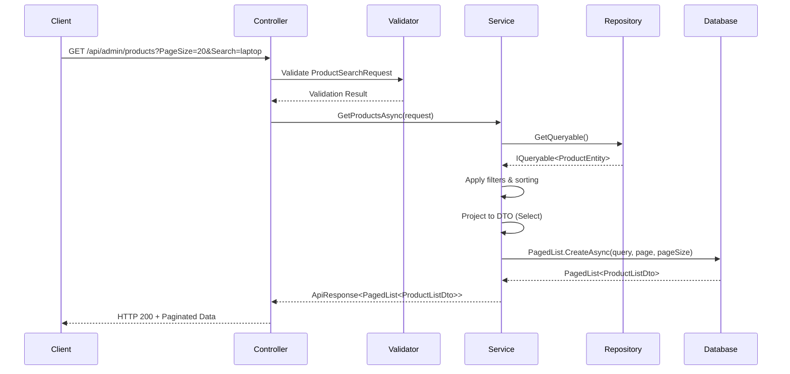

# Hướng Dẫn Triển Khai Cơ Chế Phân Trang (Pagination Implementation Guide)

## Mục Lục

1. [Tổng Quan Kiến Trúc](#1-tổng-quan-kiến-trúc)
2. [Các Thành Phần Chính](#2-các-thành-phần-chính)
3. [Luồng Xử Lý Phân Trang](#3-luồng-xử-lý-phân-trang)
4. [Code Examples Chi Tiết](#4-code-examples-chi-tiết)
5. [Hướng Dẫn Từng Bước](#5-hướng-dẫn-từng-bước)
6. [Best Practices](#6-best-practices)
7. [Common Pitfalls](#7-common-pitfalls)
8. [Migration từ Cách Cũ sang BasePaginationValidator](#8-migration-từ-cách-cũ-sang-basepaginationvalidator)
9. [Troubleshooting](#9-troubleshooting)

---

## 1. Tổng Quan Kiến Trúc

Dự án sử dụng **Traditional Service Pattern** (không phải CQRS/MediatR) với kiến trúc phân lớp:

```
┌─────────────────┐    ┌─────────────────┐    ┌─────────────────┐
│   Controller    │───▶│    Service      │───▶│   Repository    │
│                 │    │                 │    │                 │
│ - Nhận request  │    │ - Business      │    │ - Data access   │
│ - Validation    │    │   logic         │    │ - Query build   │
│ - Return result │    │ - Filtering     │    │ - EF Core       │
└─────────────────┘    └─────────────────┘    └─────────────────┘
         │                       │                       │
         ▼                       ▼                       ▼
┌─────────────────┐    ┌─────────────────┐    ┌─────────────────┐
│ SearchRequest   │    │   PagedList     │    │   Entity        │
│ (Input DTO)     │    │  (Output DTO)   │    │   (Database)    │
└─────────────────┘    └─────────────────┘    └─────────────────┘
```

### Đặc điểm chính:
- **Service-based architecture**: Không sử dụng CQRS/MediatR
- **Specialized Request Models**: Mỗi entity có SearchRequest riêng
- **Generic PagedList**: Tái sử dụng cho tất cả entities
- **FluentValidation**: Automatic validation registration
- **EF Core optimization**: AsNoTracking, Select projection

---

## 2. Các Thành Phần Chính

### 2.1. Base Classes

#### BasePaginationValidator (Validators/BasePaginationValidator.cs)
```csharp
public abstract class BasePaginationValidator<T> : AbstractValidator<T> where T : PagedRequest
{
    protected BasePaginationValidator()
    {
        // Validation cho Page
        RuleFor(x => x.Page)
            .GreaterThan(0)
            .WithMessage("Page must be greater than 0");

        // Validation cho PageSize
        RuleFor(x => x.PageSize)
            .GreaterThan(0)
            .WithMessage("PageSize must be greater than 0")
            .LessThanOrEqualTo(100)
            .WithMessage("PageSize must not exceed 100");

        // Validation cho SortBy
        RuleFor(x => x.SortBy)
            .NotEmpty()
            .WithMessage("SortBy must not be empty");

        // Validation cho Search (optional)
        RuleFor(x => x.Search)
            .MaximumLength(255)
            .WithMessage("Search term must not exceed 255 characters")
            .When(x => !string.IsNullOrEmpty(x.Search));
    }
}
```

**Đặc điểm:**
- **Abstract generic base class** cho tất cả pagination validators
- **Centralized validation rules** - tránh duplicate code
- **Consistent validation** - đảm bảo tất cả pagination requests có cùng validation logic
- **Extensible** - specialized validators chỉ cần kế thừa và thêm rules riêng

#### PagedRequest (Models/Common/PagedRequest.cs)
```csharp
public class PagedRequest
{
    private const int MaxPageSize = 100;
    public int Page { get; set; } = 1;
    private int _pageSize = 10;

    public int PageSize
    {
        get => _pageSize;
        set => _pageSize = (value > MaxPageSize) ? MaxPageSize : value;
    }

    public string? Search { get; set; }
    public string SortBy { get; set; } = "Id";
    public bool SortDesc { get; set; } = true;
}
```

**⚠️ Lưu ý quan trọng**: Có **hai** class `PagedRequest` khác nhau:
- `Common/PagedRequest.cs` - Không có giới hạn PageSize (Xóa đi, đây là một cấu trúc cũ)
- `Models/Common/PagedRequest.cs` - Có giới hạn `MaxPageSize = 100`


### 2.2. Specialized Request Models

#### ProductSearchRequest
```csharp
public class ProductSearchRequest : PagedRequest
{
    public int? CategoryId { get; set; }
    public int? SupplierId { get; set; }
    public decimal? MinPrice { get; set; }
    public decimal? MaxPrice { get; set; }
}
```

#### CategorySearchRequest
```csharp
public class CategorySearchRequest : PagedRequest
{
    public int? MinProductCount { get; set; }
    public int? MaxProductCount { get; set; }
    public DateTime? CreatedAfter { get; set; }
    public DateTime? CreatedBefore { get; set; }
}
```

---

## 3. Luồng Xử Lý Phân Trang



---

## 4. Code Examples Chi Tiết

### 4.1. Controller Layer

```csharp
[ApiController]
[Route("api/admin/products")]
[Authorize(Roles = "Admin")]
public class ProductsController : ControllerBase
{
    private readonly IProductService _productService;

    public ProductsController(IProductService productService)
    {
        _productService = productService;
    }

    [HttpGet]
    public async Task<IActionResult> GetProducts([FromQuery] ProductSearchRequest request)
    {
        var result = await _productService.GetProductsAsync(request);
        return StatusCode(result.StatusCode, result);
    }
}
```

**Giải thích:**
- `[FromQuery]` - Bind query parameters tự động
- `ProductSearchRequest` - Specialized request model với filters riêng
- `StatusCode(result.StatusCode, result)` - Sử dụng ApiResponse wrapper

### 4.2. Service Layer

```csharp
public async Task<ApiResponse<PagedList<ProductListDto>>> GetProductsAsync(ProductSearchRequest request)
{
    try
    {
        var query = _unitOfWork.Products.GetQueryable();

        // Apply search filter
        if (!string.IsNullOrEmpty(request.Search))
        {
            query = query.Where(p => p.ProductName.Contains(request.Search) ||
                                    p.Barcode!.Contains(request.Search));
        }

        // Apply category filter
        if (request.CategoryId.HasValue)
        {
            query = query.Where(p => p.CategoryId == request.CategoryId.Value);
        }

        // Apply supplier filter
        if (request.SupplierId.HasValue)
        {
            query = query.Where(p => p.SupplierId == request.SupplierId.Value);
        }

        // Apply price filters
        if (request.MinPrice.HasValue)
        {
            query = query.Where(p => p.Price >= request.MinPrice.Value);
        }

        if (request.MaxPrice.HasValue)
        {
            query = query.Where(p => p.Price <= request.MaxPrice.Value);
        }

        // Apply sorting
        query = request.SortDesc
            ? query.OrderByDescending(p => EF.Property<object>(p, request.SortBy))
            : query.OrderBy(p => EF.Property<object>(p, request.SortBy));

        // Include related entities and project to DTO
        var dtoQuery = query
            .Include(p => p.Category)
            .Include(p => p.Supplier)
            .Include(p => p.Inventory)
            .Select(p => new ProductListDto
            {
                Id = p.Id,
                ProductName = p.ProductName,
                Barcode = p.Barcode ?? string.Empty,
                Price = p.Price,
                Unit = p.Unit ?? string.Empty,
                CategoryName = p.Category != null ? p.Category.CategoryName : string.Empty,
                SupplierName = p.Supplier != null ? p.Supplier.Name : string.Empty,
                InventoryQuantity = p.Inventory != null ? p.Inventory.Quantity : 0
            });

        // Use PagedList.CreateAsync for database-level pagination
        var pagedList = await PagedList<ProductListDto>.CreateAsync(dtoQuery, request.Page, request.PageSize);

        return ApiResponse<PagedList<ProductListDto>>.Success(pagedList);
    }
    catch (Exception ex)
    {
        return ApiResponse<PagedList<ProductListDto>>.Error(ex.Message);
    }
}
```

**Giải thích từng bước:**
1. **GetQueryable()** - Lấy IQueryable từ repository
2. **Apply filters** - Áp dụng các bộ lọc theo điều kiện
3. **Apply sorting** - Sắp xếp động bằng EF.Property
4. **Include & Select** - Load related data và project sang DTO
5. **PagedList.CreateAsync** - Thực hiện phân trang tại database level

### 4.3. Validation Layer

#### Base Validator (Sử dụng BasePaginationValidator)
```csharp
public class PagedRequestValidator : BasePaginationValidator<PagedRequest>
{
    public PagedRequestValidator()
    {
        // Base pagination validation rules inherited from BasePaginationValidator
        // No additional rules needed for base PagedRequest
    }
}
```

#### Specialized Validator (Kế thừa từ BasePaginationValidator)
```csharp
public class CategorySearchRequestValidator : BasePaginationValidator<CategorySearchRequest>
{
    public CategorySearchRequestValidator()
    {
        // Base pagination validation rules inherited from BasePaginationValidator
        // Page, PageSize, SortBy, Search validation tự động có sẵn

        // Chỉ cần thêm specialized validation rules
        RuleFor(x => x.MinProductCount)
            .GreaterThanOrEqualTo(0)
            .WithMessage("MinProductCount must be greater than or equal to 0")
            .When(x => x.MinProductCount.HasValue);

        RuleFor(x => x.MaxProductCount)
            .GreaterThanOrEqualTo(0)
            .WithMessage("MaxProductCount must be greater than or equal to 0")
            .When(x => x.MaxProductCount.HasValue);

        // Range validation
        RuleFor(x => x)
            .Must(x => !x.MinProductCount.HasValue || !x.MaxProductCount.HasValue ||
                      x.MinProductCount.Value <= x.MaxProductCount.Value)
            .WithMessage("MinProductCount must be less than or equal to MaxProductCount")
            .When(x => x.MinProductCount.HasValue && x.MaxProductCount.HasValue);

        // Date validation
        RuleFor(x => x.CreatedAfter)
            .LessThanOrEqualTo(DateTime.UtcNow)
            .WithMessage("CreatedAfter cannot be in the future")
            .When(x => x.CreatedAfter.HasValue);

        RuleFor(x => x.CreatedBefore)
            .LessThanOrEqualTo(DateTime.UtcNow)
            .WithMessage("CreatedBefore cannot be in the future")
            .When(x => x.CreatedBefore.HasValue);

        // Date range validation
        RuleFor(x => x)
            .Must(x => !x.CreatedAfter.HasValue || !x.CreatedBefore.HasValue ||
                      x.CreatedAfter.Value <= x.CreatedBefore.Value)
            .WithMessage("CreatedAfter must be less than or equal to CreatedBefore")
            .When(x => x.CreatedAfter.HasValue && x.CreatedBefore.HasValue);
    }
}
```

#### ProductSearchRequestValidator Example
```csharp
public class ProductSearchRequestValidator : BasePaginationValidator<ProductSearchRequest>
{
    public ProductSearchRequestValidator()
    {
        // Base pagination validation rules inherited from BasePaginationValidator

        // Product-specific validation rules
        RuleFor(x => x.CategoryId)
            .GreaterThan(0)
            .WithMessage("CategoryId must be greater than 0")
            .When(x => x.CategoryId.HasValue);

        RuleFor(x => x.SupplierId)
            .GreaterThan(0)
            .WithMessage("SupplierId must be greater than 0")
            .When(x => x.SupplierId.HasValue);

        RuleFor(x => x.MinPrice)
            .GreaterThanOrEqualTo(0)
            .WithMessage("MinPrice must be greater than or equal to 0")
            .When(x => x.MinPrice.HasValue);

        RuleFor(x => x.MaxPrice)
            .GreaterThanOrEqualTo(0)
            .WithMessage("MaxPrice must be greater than or equal to 0")
            .When(x => x.MaxPrice.HasValue);

        // Price range validation
        RuleFor(x => x)
            .Must(x => !x.MinPrice.HasValue || !x.MaxPrice.HasValue ||
                      x.MinPrice.Value <= x.MaxPrice.Value)
            .WithMessage("MinPrice must be less than or equal to MaxPrice")
            .When(x => x.MinPrice.HasValue && x.MaxPrice.HasValue);
    }
}
```

### 4.4. Dependency Injection Configuration

```csharp
// Program.cs
// FluentValidation
builder.Services.AddFluentValidationAutoValidation();
builder.Services.AddValidatorsFromAssemblyContaining<Program>();

// Services
builder.Services.AddScoped<IProductService, ProductService>();
builder.Services.AddScoped<ICategoryService, CategoryService>();
```

**Giải thích:**
- `AddFluentValidationAutoValidation()` - Tự động validation cho model binding
- `AddValidatorsFromAssemblyContaining<Program>()` - Tự động đăng ký tất cả validators

---

## 5. Hướng Dẫn Từng Bước

### Bước 1: Tạo Specialized Request Model

```csharp
// Models/Common/YourEntitySearchRequest.cs
namespace RetailStoreManagement.Models.Common;

public class YourEntitySearchRequest : PagedRequest
{
    // Thêm các filter properties riêng cho entity
    public string? Status { get; set; }
    public int? CategoryId { get; set; }
    public DateTime? CreatedAfter { get; set; }
    public DateTime? CreatedBefore { get; set; }
    public decimal? MinAmount { get; set; }
    public decimal? MaxAmount { get; set; }
}
```

### Bước 2: Tạo Validator (Kế thừa từ BasePaginationValidator)

```csharp
// Validators/YourEntitySearchRequestValidator.cs
using FluentValidation;
using RetailStoreManagement.Models.Common;
using RetailStoreManagement.Validators;

namespace RetailStoreManagement.Validators;

public class YourEntitySearchRequestValidator : BasePaginationValidator<YourEntitySearchRequest>
{
    public YourEntitySearchRequestValidator()
    {
        // Base pagination validation rules inherited from BasePaginationValidator
        // Page, PageSize, SortBy, Search validation tự động có sẵn
        // Không cần copy lại các rules này!

        // Chỉ cần thêm validation rules cho filters riêng của entity
        RuleFor(x => x.MinAmount)
            .GreaterThanOrEqualTo(0)
            .WithMessage("MinAmount must be greater than or equal to 0")
            .When(x => x.MinAmount.HasValue);

        RuleFor(x => x.MaxAmount)
            .GreaterThanOrEqualTo(0)
            .WithMessage("MaxAmount must be greater than or equal to 0")
            .When(x => x.MaxAmount.HasValue);

        // Range validation
        RuleFor(x => x)
            .Must(x => !x.MinAmount.HasValue || !x.MaxAmount.HasValue ||
                      x.MinAmount.Value <= x.MaxAmount.Value)
            .WithMessage("MinAmount must be less than or equal to MaxAmount")
            .When(x => x.MinAmount.HasValue && x.MaxAmount.HasValue);
    }
}
```

**Lợi ích của cách tiếp cận mới:**
- ✅ **Không duplicate code** - Base validation rules chỉ định nghĩa một lần
- ✅ **Consistency** - Tất cả validators có cùng base validation logic
- ✅ **Maintainability** - Thay đổi base rules chỉ cần sửa ở một nơi
- ✅ **Clean code** - Specialized validators chỉ focus vào business rules riêng

### Bước 3: Cập Nhật Service Interface

```csharp
// Interfaces/Services/IYourEntityService.cs
public interface IYourEntityService
{
    Task<ApiResponse<PagedList<YourEntityListDto>>> GetYourEntitiesAsync(YourEntitySearchRequest request);
    // ... other methods
}
```

### Bước 4: Implement Service Method

```csharp
// Services/YourEntityService.cs
public async Task<ApiResponse<PagedList<YourEntityListDto>>> GetYourEntitiesAsync(YourEntitySearchRequest request)
{
    try
    {
        // 1. Get base query
        var query = _unitOfWork.YourEntities.GetQueryable()
            .AsNoTracking(); // Optimization for read-only queries

        // 2. Apply search filter
        if (!string.IsNullOrEmpty(request.Search))
        {
            var searchTerm = request.Search.Trim();
            query = query.Where(e => e.Name.Contains(searchTerm) ||
                                   e.Description.Contains(searchTerm));
        }

        // 3. Apply specialized filters
        if (!string.IsNullOrEmpty(request.Status))
        {
            query = query.Where(e => e.Status == request.Status);
        }

        if (request.CategoryId.HasValue)
        {
            query = query.Where(e => e.CategoryId == request.CategoryId.Value);
        }

        if (request.MinAmount.HasValue)
        {
            query = query.Where(e => e.Amount >= request.MinAmount.Value);
        }

        if (request.MaxAmount.HasValue)
        {
            query = query.Where(e => e.Amount <= request.MaxAmount.Value);
        }

        if (request.CreatedAfter.HasValue)
        {
            query = query.Where(e => e.CreatedAt >= request.CreatedAfter.Value);
        }

        if (request.CreatedBefore.HasValue)
        {
            query = query.Where(e => e.CreatedAt <= request.CreatedBefore.Value);
        }

        // 4. Apply sorting
        query = request.SortDesc
            ? query.OrderByDescending(e => EF.Property<object>(e, request.SortBy))
            : query.OrderBy(e => EF.Property<object>(e, request.SortBy));

        // 5. Project to DTO (keep IQueryable for database-level projection)
        var dtoQuery = query
            .Include(e => e.Category) // Include related entities if needed
            .Select(e => new YourEntityListDto
            {
                Id = e.Id,
                Name = e.Name,
                Status = e.Status,
                Amount = e.Amount,
                CategoryName = e.Category != null ? e.Category.Name : string.Empty,
                CreatedAt = e.CreatedAt
            });

        // 6. Execute pagination at database level
        var pagedList = await PagedList<YourEntityListDto>.CreateAsync(
            dtoQuery,
            request.Page,
            request.PageSize
        );

        return ApiResponse<PagedList<YourEntityListDto>>.Success(pagedList);
    }
    catch (Exception ex)
    {
        return ApiResponse<PagedList<YourEntityListDto>>.Error(ex.Message);
    }
}
```

### Bước 5: Cập Nhật Controller

```csharp
// Controllers/Admin/YourEntitiesController.cs
[ApiController]
[Route("api/admin/yourentities")]
[Authorize(Roles = "Admin")]
public class YourEntitiesController : ControllerBase
{
    private readonly IYourEntityService _yourEntityService;

    public YourEntitiesController(IYourEntityService yourEntityService)
    {
        _yourEntityService = yourEntityService;
    }

    [HttpGet]
    public async Task<IActionResult> GetYourEntities([FromQuery] YourEntitySearchRequest request)
    {
        var result = await _yourEntityService.GetYourEntitiesAsync(request);
        return StatusCode(result.StatusCode, result);
    }
}
```

### Bước 6: Đăng Ký Service (nếu chưa có)

```csharp
// Program.cs
builder.Services.AddScoped<IYourEntityService, YourEntityService>();
```

**✅ Hoàn thành!** Validator sẽ được tự động đăng ký nhờ `AddValidatorsFromAssemblyContaining<Program>()`.

---

## 6. Best Practices

### 6.1. Query Optimization

#### ✅ DO: Sử dụng AsNoTracking cho read-only queries
```csharp
var query = _unitOfWork.Categories.GetQueryable()
    .AsNoTracking() // Tối ưu hiệu năng
    .Include(c => c.Products);
```

#### ✅ DO: Giữ IQueryable cho đến khi phân trang
```csharp
// ✅ ĐÚNG: Project sang DTO nhưng vẫn giữ IQueryable
var dtoQuery = query.Select(p => new ProductListDto
{
    Id = p.Id,
    ProductName = p.ProductName,
    // ... other properties
});

// Phân trang tại database level
var pagedList = await PagedList<ProductListDto>.CreateAsync(dtoQuery, request.Page, request.PageSize);
```

#### ❌ DON'T: ToList() trước khi phân trang
```csharp
// ❌ SAI: Load toàn bộ data vào memory trước
var allItems = await query.ToListAsync(); // Tải hết vào RAM
var pagedItems = allItems.Skip((page - 1) * pageSize).Take(pageSize); // Phân trang trong RAM
```

### 6.2. Validation Best Practices

#### ✅ DO: Sử dụng BasePaginationValidator để kế thừa
```csharp
// ✅ ĐÚNG: Kế thừa từ BasePaginationValidator
public class CategorySearchRequestValidator : BasePaginationValidator<CategorySearchRequest>
{
    public CategorySearchRequestValidator()
    {
        // Base pagination rules inherited automatically
        // Chỉ cần thêm specialized rules
        RuleFor(x => x.MinProductCount)
            .GreaterThanOrEqualTo(0)
            .When(x => x.MinProductCount.HasValue);
    }
}
```

#### ❌ DON'T: Copy paste validation rules
```csharp
// ❌ SAI: Duplicate code, khó maintain
public class CategorySearchRequestValidator : AbstractValidator<CategorySearchRequest>
{
    public CategorySearchRequestValidator()
    {
        // ❌ Duplicate base rules - khó maintain
        RuleFor(x => x.Page).GreaterThan(0);
        RuleFor(x => x.PageSize).GreaterThan(0).LessThanOrEqualTo(100);
        RuleFor(x => x.SortBy).NotEmpty();

        // Specialized rules
        RuleFor(x => x.MinProductCount).GreaterThanOrEqualTo(0).When(x => x.MinProductCount.HasValue);
    }
}
```

#### ❌ DON'T: Sử dụng Include() với validators
```csharp
// ❌ SAI: Include() gây lỗi type mismatch
public CategorySearchRequestValidator()
{
    Include(new PagedRequestValidator()); // Lỗi compilation
}
```

### 6.3. MaxPageSize Configuration

#### ⚠️ QUAN TRỌNG: Đảm bảo tính nhất quán giữa các layers

```csharp
// Models/Common/PagedRequest.cs
private const int MaxPageSize = 100; // ← Phải khớp với validator

// Validators/PagedRequestValidator.cs
RuleFor(x => x.PageSize)
    .LessThanOrEqualTo(100); // ← Phải khớp với MaxPageSize

// Common/PagedList.cs
if (pageSize > 100) pageSize = 100; // ← Phải khớp với cả hai
```

### 6.4. Search Optimization

#### ✅ DO: Trim search terms
```csharp
if (!string.IsNullOrEmpty(request.Search))
{
    var searchTerm = request.Search.Trim(); // Loại bỏ khoảng trắng thừa
    query = query.Where(c => c.CategoryName.Contains(searchTerm));
}
```

#### ✅ DO: Sử dụng nullable filters
```csharp
// ✅ ĐÚNG: Chỉ áp dụng filter khi có giá trị
if (request.CategoryId.HasValue)
{
    query = query.Where(p => p.CategoryId == request.CategoryId.Value);
}
```

### 6.5. Error Handling

#### ✅ DO: Wrap service methods trong try-catch
```csharp
public async Task<ApiResponse<PagedList<ProductListDto>>> GetProductsAsync(ProductSearchRequest request)
{
    try
    {
        // Implementation
        return ApiResponse<PagedList<ProductListDto>>.Success(pagedList);
    }
    catch (Exception ex)
    {
        return ApiResponse<PagedList<ProductListDto>>.Error(ex.Message);
    }
}
```

---

## 7. Common Pitfalls

### 7.1. MaxPageSize Inconsistency

**❌ Vấn đề**: PageSize bị giới hạn không mong muốn

```csharp
// Request: PageSize=100
// Response: pageSize=50 (bị giới hạn)
```

**✅ Giải pháp**: Kiểm tra tất cả các nơi có thể giới hạn PageSize:

1. **Models/Common/PagedRequest.cs**:
```csharp
private const int MaxPageSize = 100; // Đảm bảo = 100
```

2. **Validators**:
```csharp
RuleFor(x => x.PageSize).LessThanOrEqualTo(100); // Đảm bảo = 100
```

3. **PagedList.CreateAsync**:
```csharp
if (pageSize > 100) pageSize = 100; // Đảm bảo = 100
```

### 7.2. N+1 Query Problem

**❌ Vấn đề**: Không sử dụng Include() hoặc Select() đúng cách

```csharp
// ❌ SAI: Gây N+1 queries
var categories = await query.ToListAsync();
foreach (var category in categories)
{
    var productCount = category.Products.Count(); // N+1 query
}
```

**✅ Giải pháp**: Sử dụng Include() và Select() projection

```csharp
// ✅ ĐÚNG: Single query với projection
var dtoQuery = query
    .Include(c => c.Products)
    .Select(c => new CategoryResponseDto
    {
        Id = c.Id,
        CategoryName = c.CategoryName,
        ProductCount = c.Products.Count() // Calculated in database
    });
```

### 7.3. Memory Issues với Large Datasets

**❌ Vấn đề**: Load toàn bộ data vào memory

```csharp
// ❌ SAI: Load tất cả records vào RAM
var allProducts = await _context.Products.ToListAsync(); // 1M records = OutOfMemory
var pagedProducts = allProducts.Skip(skip).Take(take);
```

**✅ Giải pháp**: Database-level pagination

```csharp
// ✅ ĐÚNG: Pagination tại database
var pagedList = await PagedList<ProductDto>.CreateAsync(query, page, pageSize);
```

### 7.4. Validation Architecture Issues

**❌ Vấn đề**: Sử dụng Include() với validators

```csharp
// ❌ SAI: Type mismatch error
public class CategorySearchRequestValidator : AbstractValidator<CategorySearchRequest>
{
    public CategorySearchRequestValidator()
    {
        Include(new PagedRequestValidator()); // CS1503 error
    }
}
```

**✅ Giải pháp**: Sử dụng BasePaginationValidator

```csharp
// ✅ ĐÚNG: Kế thừa từ BasePaginationValidator
public class CategorySearchRequestValidator : BasePaginationValidator<CategorySearchRequest>
{
    public CategorySearchRequestValidator()
    {
        // Base validation rules inherited automatically
        // Chỉ cần thêm specialized rules
        RuleFor(x => x.MinProductCount)
            .GreaterThanOrEqualTo(0)
            .When(x => x.MinProductCount.HasValue);
    }
}
```

**❌ Vấn đề**: Copy-paste validation rules (cách cũ)

```csharp
// ❌ SAI: Duplicate code, khó maintain
public class CategorySearchRequestValidator : AbstractValidator<CategorySearchRequest>
{
    public CategorySearchRequestValidator()
    {
        // ❌ Duplicate base rules
        RuleFor(x => x.Page).GreaterThan(0);
        RuleFor(x => x.PageSize).GreaterThan(0).LessThanOrEqualTo(100);
        RuleFor(x => x.SortBy).NotEmpty();
        // ...
    }
}
```

### 7.5. Sorting Issues

**❌ Vấn đề**: Hard-coded sorting

```csharp
// ❌ SAI: Không flexible
query = query.OrderBy(p => p.ProductName);
```

**✅ Giải pháp**: Dynamic sorting với EF.Property

```csharp
// ✅ ĐÚNG: Dynamic sorting
query = request.SortDesc
    ? query.OrderByDescending(p => EF.Property<object>(p, request.SortBy))
    : query.OrderBy(p => EF.Property<object>(p, request.SortBy));
```

---

## 8. Migration từ Cách Cũ sang BasePaginationValidator

### 8.1. Cách Migration

#### Bước 1: Tạo BasePaginationValidator (đã có sẵn)
```csharp
// Validators/BasePaginationValidator.cs - đã được tạo
public abstract class BasePaginationValidator<T> : AbstractValidator<T> where T : PagedRequest
{
    protected BasePaginationValidator()
    {
        // Common pagination validation rules
        RuleFor(x => x.Page).GreaterThan(0).WithMessage("Page must be greater than 0");
        RuleFor(x => x.PageSize).GreaterThan(0).WithMessage("PageSize must be greater than 0")
            .LessThanOrEqualTo(100).WithMessage("PageSize must not exceed 100");
        RuleFor(x => x.SortBy).NotEmpty().WithMessage("SortBy must not be empty");
        RuleFor(x => x.Search).MaximumLength(255).WithMessage("Search term must not exceed 255 characters")
            .When(x => !string.IsNullOrEmpty(x.Search));
    }
}
```

#### Bước 2: Cập nhật Existing Validators
```csharp
// TRƯỚC: Cách cũ với duplicate code
public class CategorySearchRequestValidator : AbstractValidator<CategorySearchRequest>
{
    public CategorySearchRequestValidator()
    {
        // ❌ Duplicate base rules
        RuleFor(x => x.Page).GreaterThan(0).WithMessage("Page must be greater than 0");
        RuleFor(x => x.PageSize).GreaterThan(0).WithMessage("PageSize must be greater than 0")
            .LessThanOrEqualTo(100).WithMessage("PageSize must not exceed 100");
        RuleFor(x => x.SortBy).NotEmpty().WithMessage("SortBy must not be empty");

        // Specialized rules
        RuleFor(x => x.MinProductCount).GreaterThanOrEqualTo(0).When(x => x.MinProductCount.HasValue);
    }
}

// SAU: Cách mới với inheritance
public class CategorySearchRequestValidator : BasePaginationValidator<CategorySearchRequest>
{
    public CategorySearchRequestValidator()
    {
        // ✅ Base rules inherited automatically
        // Chỉ cần specialized rules
        RuleFor(x => x.MinProductCount).GreaterThanOrEqualTo(0).When(x => x.MinProductCount.HasValue);
    }
}
```

#### Bước 3: Lợi ích sau Migration
- ✅ **Giảm 70% code** trong validators
- ✅ **Consistency** - tất cả validators có cùng base validation
- ✅ **Maintainability** - thay đổi base rules chỉ cần sửa một nơi
- ✅ **Clean code** - specialized validators chỉ focus vào business logic

---

## 9. Troubleshooting

### 8.1. PageSize không hoạt động đúng

**Triệu chứng**: Request PageSize=100 nhưng response chỉ có 50 items

**Nguyên nhân**: Có nhiều nơi có thể giới hạn PageSize

**Cách kiểm tra**:
1. Kiểm tra `Models/Common/PagedRequest.cs` - MaxPageSize constant
2. Kiểm tra validator rules - LessThanOrEqualTo value
3. Kiểm tra `PagedList.CreateAsync` - hard-coded limits

### 8.2. Validation không hoạt động

**Triệu chứng**: Invalid requests vẫn pass qua controller

**Nguyên nhân**: FluentValidation chưa được đăng ký đúng

**Cách kiểm tra**:
```csharp
// Program.cs - Đảm bảo có 2 dòng này
builder.Services.AddFluentValidationAutoValidation();
builder.Services.AddValidatorsFromAssemblyContaining<Program>();
```

### 8.3. Performance Issues

**Triệu chứng**: Query chậm, timeout

**Cách kiểm tra**:
1. Đảm bảo sử dụng `AsNoTracking()` cho read-only queries
2. Kiểm tra có sử dụng `Select()` projection không
3. Kiểm tra có N+1 query problem không (sử dụng SQL Profiler)
4. Đảm bảo có indexes trên các cột được filter/sort

### 8.4. Memory Issues

**Triệu chứng**: OutOfMemoryException với large datasets

**Cách kiểm tra**:
1. Đảm bảo không có `ToList()` trước khi pagination
2. Kiểm tra có giữ `IQueryable` cho đến `PagedList.CreateAsync` không
3. Kiểm tra PageSize có quá lớn không (> 100)

---

## 9. API Usage Examples

### 9.1. Basic Pagination
```http
GET /api/admin/categories?Page=1&PageSize=20
```

### 9.2. With Search
```http
GET /api/admin/categories?Page=1&PageSize=20&Search=electronics
```

### 9.3. With Filters
```http
GET /api/admin/categories?Page=1&PageSize=20&MinProductCount=5&MaxProductCount=50
```

### 9.4. With Sorting
```http
GET /api/admin/categories?Page=1&PageSize=20&SortBy=ProductCount&SortDesc=true
```

### 9.5. Complex Query
```http
GET /api/admin/products?Page=2&PageSize=25&Search=laptop&CategoryId=1&MinPrice=500&MaxPrice=2000&SortBy=Price&SortDesc=false
```

### 9.6. Response Format
```json
{
  "isError": false,
  "message": null,
  "data": {
    "page": 1,
    "pageSize": 20,
    "totalCount": 150,
    "totalPages": 8,
    "hasPrevious": false,
    "hasNext": true,
    "items": [
      {
        "id": 1,
        "categoryName": "Electronics",
        "productCount": 25
      }
    ]
  },
  "timestamp": "2024-11-07T10:30:00Z",
  "statusCode": 200
}
```

---

## 10. Checklist cho Implementation

### ✅ Pre-Implementation Checklist

- [ ] Đã phân tích entity và xác định các filters cần thiết
- [ ] Đã xem xét các relationships với entities khác
- [ ] Đã xác định các fields cần thiết cho DTO response
- [ ] Đã lên kế hoạch cho sorting fields

### ✅ Implementation Checklist

- [ ] **Models**: Tạo `YourEntitySearchRequest : PagedRequest`
- [ ] **Validators**: Tạo `YourEntitySearchRequestValidator`
- [ ] **Interface**: Cập nhật `IYourEntityService` với method mới
- [ ] **Service**: Implement `GetYourEntitiesAsync(YourEntitySearchRequest)`
- [ ] **Controller**: Cập nhật endpoint với `[FromQuery] YourEntitySearchRequest`
- [ ] **DI**: Đăng ký service trong `Program.cs` (nếu chưa có)

### ✅ Testing Checklist

- [ ] Test basic pagination (Page=1, PageSize=10)
- [ ] Test edge cases (Page=0, PageSize=0, PageSize>100)
- [ ] Test search functionality
- [ ] Test all filter combinations
- [ ] Test sorting (asc/desc, different fields)
- [ ] Test validation errors
- [ ] Test performance với large datasets
- [ ] Test API response format

### ✅ Code Review Checklist

- [ ] Sử dụng `AsNoTracking()` cho read-only queries
- [ ] Giữ `IQueryable` cho đến khi pagination
- [ ] Sử dụng `Select()` projection thay vì AutoMapper
- [ ] Có proper error handling với try-catch
- [ ] Validation rules đầy đủ và chính xác
- [ ] MaxPageSize consistent across all layers
- [ ] Không có N+1 query issues
- [ ] Code comments đầy đủ và rõ ràng

---

**🎉 Chúc mừng!** Bạn đã hoàn thành việc implement pagination mechanism theo đúng pattern của dự án. Tài liệu này sẽ giúp đảm bảo tính nhất quán và chất lượng code trong toàn bộ dự án.

