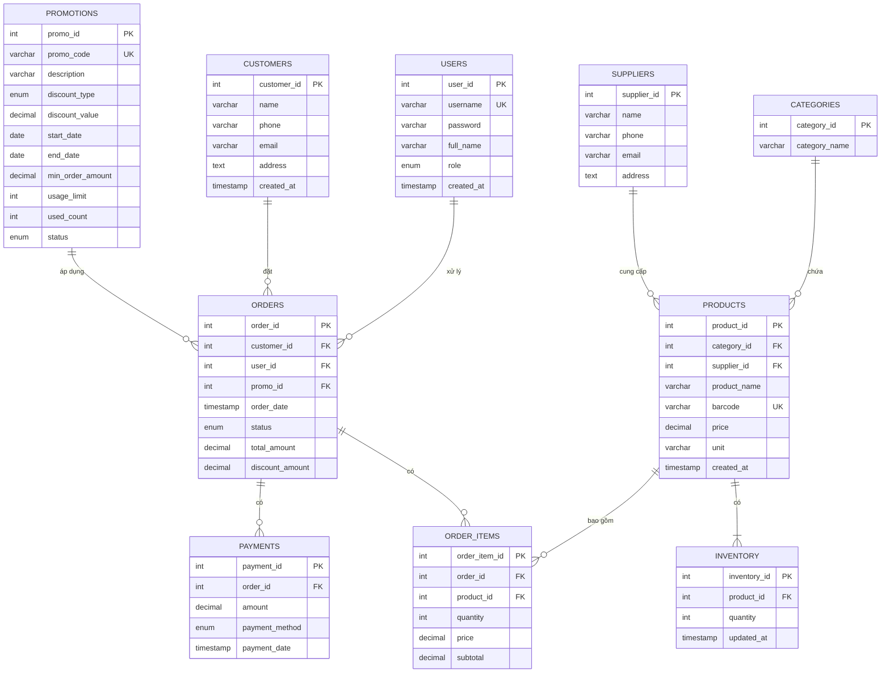

# Phân tích ERD hệ thống quản lý cửa hàng

## 1. Giới thiệu

Tài liệu này trình bày phân tích thiết kế Cơ sở dữ liệu của hệ thống quản lý cửa hàng, sử dụng mô hình Thực thể - Quan hệ (ERD), dựa trên file `store_management_full.sql`.

## 2. Phân tích ERD

### 2.1. Bước 1: Xác định tập thực thể

Tập thực thể đầy đủ của hệ thống bao gồm:

1.  **Users (Người dùng)**: Đại diện cho người dùng hệ thống (admin, staff).
2.  **Customers (Khách hàng)**: Đại diện cho thông tin khách hàng.
3.  **Categories (Loại sản phẩm)**: Phân loại sản phẩm.
4.  **Suppliers (Nhà cung cấp)**: Thông tin về các nhà cung cấp sản phẩm.
5.  **Products (Sản phẩm)**: Đại diện cho sản phẩm trong hệ thống.
6.  **Inventory (Tồn kho)**: Quản lý số lượng tồn kho của sản phẩm.
7.  **Promotions (Khuyến mãi)**: Các chương trình khuyến mãi.
8.  **Orders (Đơn hàng)**: Thông tin về đơn hàng của khách hàng.
9.  **Order_Items (Chi tiết đơn hàng)**: Chi tiết các sản phẩm trong mỗi đơn hàng.
10. **Payments (Thanh toán)**: Thông tin thanh toán của đơn hàng.

### 2.2. Bước 2: Xác định mối quan hệ

*   **Users - Orders**: Một người dùng (staff) có thể xử lý nhiều đơn hàng, một đơn hàng được xử lý bởi một người dùng (1:N).
*   **Customers - Orders**: Một khách hàng có thể đặt nhiều đơn hàng, một đơn hàng thuộc về một khách hàng (1:N).
*   **Categories - Products**: Một loại sản phẩm có thể chứa nhiều sản phẩm, một sản phẩm thuộc về một loại sản phẩm (1:N).
*   **Suppliers - Products**: Một nhà cung cấp có thể cung cấp nhiều sản phẩm, một sản phẩm được cung cấp bởi một nhà cung cấp (1:N).
*   **Products - Inventory**: Một sản phẩm có một mục tồn kho, một mục tồn kho thuộc về một sản phẩm (1:1).
*   **Promotions - Orders**: Một chương trình khuyến mãi có thể được áp dụng cho nhiều đơn hàng, một đơn hàng có thể sử dụng một chương trình khuyến mãi (1:N).
*   **Orders - Order_Items**: Một đơn hàng có thể có nhiều chi tiết đơn hàng, mỗi chi tiết đơn hàng thuộc về một đơn hàng (1:N).
*   **Products - Order_Items**: Một sản phẩm có thể xuất hiện trong nhiều chi tiết đơn hàng, mỗi chi tiết đơn hàng liên quan đến một sản phẩm (1:N).
*   **Orders - Payments**: Một đơn hàng có thể có nhiều thanh toán (trong trường hợp thanh toán thất bại và thử lại), một thanh toán thuộc về một đơn hàng (1:N).

### 2.3. Bước 3: Xác định thuộc tính cho thực thể

*   **Users - Orders**: Một người dùng (staff) có thể xử lý nhiều đơn hàng, một đơn hàng được xử lý bởi một người dùng (1:N).
*   **Customers - Orders**: Một khách hàng có thể đặt nhiều đơn hàng, một đơn hàng thuộc về một khách hàng (1:N).
*   **Categories - Products**: Một loại sản phẩm có thể chứa nhiều sản phẩm, một sản phẩm thuộc về một loại sản phẩm (1:N).
*   **Suppliers - Products**: Một nhà cung cấp có thể cung cấp nhiều sản phẩm, một sản phẩm được cung cấp bởi một nhà cung cấp (1:N).
*   **Products - Inventory**: Một sản phẩm có một mục tồn kho, một mục tồn kho thuộc về một sản phẩm (1:1).
*   **Promotions - Orders**: Một chương trình khuyến mãi có thể được áp dụng cho nhiều đơn hàng, một đơn hàng có thể sử dụng một chương trình khuyến mãi (1:N).
*   **Orders - Order_Items**: Một đơn hàng có thể có nhiều chi tiết đơn hàng, mỗi chi tiết đơn hàng thuộc về một đơn hàng (1:N).
*   **Products - Order_Items**: Một sản phẩm có thể xuất hiện trong nhiều chi tiết đơn hàng, mỗi chi tiết đơn hàng liên quan đến một sản phẩm (1:N).
*   **Orders - Payments**: Một đơn hàng có thể có nhiều thanh toán (trong trường hợp thanh toán thất bại và thử lại), một thanh toán thuộc về một đơn hàng (1:N).

### 2.3. Bước 3: Xác định thuộc tính cho thực thể

*   **Users**:
    *   `user_id` (PK): Mã người dùng.
    *   `username` (UK): Tên đăng nhập duy nhất.
    *   `password`: Mật khẩu (mã hóa).
    *   `full_name`: Họ và tên.
    *   `role`: Vai trò (`admin`, `staff`).
    *   `created_at`: Thời gian tạo.
*   **Customers**:
    *   `customer_id` (PK): Mã khách hàng.
    *   `name`: Tên khách hàng.
    *   `phone`: Số điện thoại.
    *   `email`: Email khách hàng.
    *   `address`: Địa chỉ khách hàng.
    *   `created_at`: Thời gian tạo.
*   **Categories**:
    *   `category_id` (PK): Mã loại sản phẩm.
    *   `category_name`: Tên loại sản phẩm.
*   **Suppliers**:
    *   `supplier_id` (PK): Mã nhà cung cấp.
    *   `name`: Tên nhà cung cấp.
    *   `phone`: Số điện thoại.
    *   `email`: Email.
    *   `address`: Địa chỉ.
*   **Products**:
    *   `product_id` (PK): Mã sản phẩm.
    *   `category_id` (FK): Mã loại sản phẩm.
    *   `supplier_id` (FK): Mã nhà cung cấp.
    *   `product_name`: Tên sản phẩm.
    *   `barcode` (UK): Mã vạch duy nhất.
    *   `price`: Giá sản phẩm.
    *   `unit`: Đơn vị tính.
    *   `created_at`: Thời gian tạo.
*   **Inventory**:
    *   `inventory_id` (PK): Mã tồn kho.
    *   `product_id` (FK): Mã sản phẩm.
    *   `quantity`: Số lượng tồn kho.
    *   `updated_at`: Thời gian cập nhật.
*   **Promotions**:
    *   `promo_id` (PK): Mã khuyến mãi.
    *   `promo_code` (UK): Mã khuyến mãi duy nhất.
    *   `description`: Mô tả khuyến mãi.
    *   `discount_type`: Loại giảm giá (`percent`, `fixed`).
    *   `discount_value`: Giá trị giảm giá.
    *   `start_date`: Ngày bắt đầu.
    *   `end_date`: Ngày kết thúc.
    *   `min_order_amount`: Giá trị đơn hàng tối thiểu để áp dụng.
    *   `usage_limit`: Giới hạn số lần sử dụng.
    *   `used_count`: Số lần đã sử dụng.
    *   `status`: Trạng thái (`active`, `inactive`).
*   **Orders**:
    *   `order_id` (PK): Mã đơn hàng.
    *   `customer_id` (FK): Mã khách hàng.
    *   `user_id` (FK): Mã người dùng (staff).
    *   `promo_id` (FK, nullable): Mã khuyến mãi (nếu có).
    *   `order_date`: Ngày đặt hàng.
    *   `status`: Trạng thái đơn hàng (`pending`, `paid`, `canceled`).
    *   `total_amount`: Tổng tiền đơn hàng.
    *   `discount_amount`: Số tiền giảm giá.
*   **Order_Items**:
    *   `order_item_id` (PK): Mã chi tiết đơn hàng.
    *   `order_id` (FK): Mã đơn hàng.
    *   `product_id` (FK): Mã sản phẩm.
    *   `quantity`: Số lượng sản phẩm.
    *   `price`: Giá sản phẩm tại thời điểm đặt hàng.
    *   `subtotal`: Tổng phụ (quantity * price).
*   **Payments**:
    *   `payment_id` (PK): Mã thanh toán.
    *   `order_id` (FK): Mã đơn hàng.
    *   `amount`: Số tiền thanh toán.
    *   `payment_method`: Phương thức thanh toán (`cash`, `card`, `bank_transfer`, `e-wallet`).
    *   `payment_date`: Ngày thanh toán.

## 3. ERD

